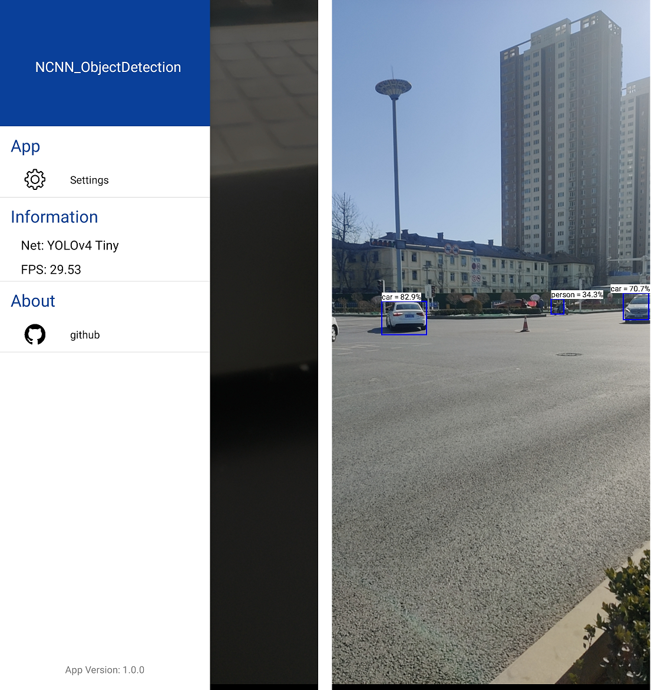

# Android Camera Object Detection
> Author: IronSublimate

use Tencent's [NCNN](https://github.com/Tencent/ncnn) framework to run yolov5 and mobilenet-ssd

## Reference Code
+ [akhilbattula / android-camerax-java](https://github.com/akhilbattula/android-camerax-java) 
+ [nihui / ncnn-android-mobilenetssd](https://github.com/nihui/ncnn-android-mobilenetssd)

## How to Build and Run
### step1
https://github.com/Tencent/ncnn/releases

download ncnn-android-vulkan-lib.zip or build ncnn for android yourself

### step2
extract ncnn-android-vulkan-lib.zip into app/src/main/jni or change the ncnn path to yours in app/src/main/jni/CMakeLists.txt

### step3
open this project with Android Studio, build it and enjoy!

## screenshot


## Development

1. Write a java class extends NCNNDetector and fininsh 3 method inherited from  NCNNDetector. These methods might be **native** methods.

   ```java
       public boolean Init(AssetManager mgr);
       public NCNNDetector.Obj[] Detect(Bitmap bitmap, boolean use_gpu);
       public boolean Deinit();
   ```

2. Write \*jni.cpp to define native methods above and add your cpp in CMakeLists.txt.

    ```cmake
    add_library(
            ncnn_detector SHARED
            NCNN_detector_public_jni.cpp
            mobilenetssdncnn_jni.cpp
            yolov5ncnn_jni.cpp
            # add your cpp here
    )
    ```
    
    **Warning** If there are more than two dynamic library(.so) both linking to libncnn.a, you will get  Fatal signal 6 (SIGABRT) in running fuction *load_param*. You must compile all \*jni.cpp into one dynamic library(libncnn_detector.so).
    
    See also https://github.com/Tencent/ncnn/issues/976 
    
    